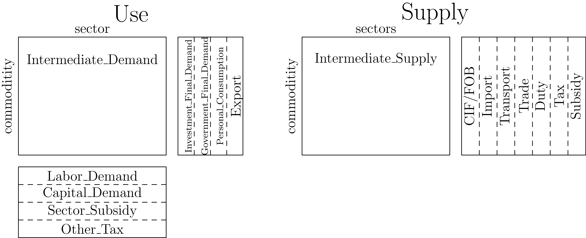
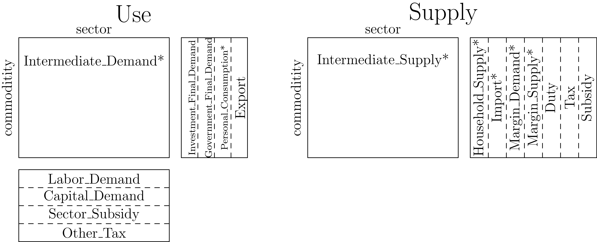

# Building the Data

This page describes the process to build the US National data. The function to build the data is [`build_us_table`](@ref).

The only necessary data for the national model is the BEA Supply and Use tables. These tables have the following structure:



Note that the parameters `Investment_Final_Demand` and `Government_Final_Demand`are collections of multiple columns. However, in the national model we don't distinguish between the values so they are all treated as a single category. The data does not get aggregated together, retrieving that parameter returns all the raw data. 

Coming from the BEA, this data is not suitable for use in our CGE models. In the following sections we will outline the steps taken to transform the raw data into a format suitable for our models.

## Flip Sign of `Use`

The first step to flip the sign of all the values in the Use table. We consider inputs to be negative.

## Reverse Negative Flows in Intermediate Tables

We want all values in the `Intermediate` tables to have the same sign as their flow. For example, in the 2023 Use table the sector `111CA` (Farms) and commodity `Used` (Scrap, Used and secondhand goods) has a value of `18`. We expect all values in the Use table to be negative. Note, this is after flipping the sign from the previous step. In the Use table that value is -18. 

To solve this issue we reverse the flow of good with the wrong sign in `Intermediate_Demand` and `Intermediate_Supply`. The `18` moves from Use to be `18` in Supply in the same commodity/sector. This is done using the function [`WiNDCNational.adjust_intermediate_flows`](@ref).

## Redistribute `CIF/FOB` Adjustments

The `CIF/FOB` column is used to adjust `Transport` margins and `Imports`. The `CIF/FOB` values get added to `Imports` values on insurance commodities and `Transport` on non-insurance commodities. In the Summary-level table their is only a single insurance commodity, `524` (Insurance carriers and related activities). In the detailed table there are three:

- `524113` (Direct life insurance carriers)
- `5241XX` (Insurance carriers, except direct life)
- `524200` (Insurance agencies, brokerages, and related activities)

The `CIF/FOB` column is then removed from our data. This is done using the function [`WiNDCNational.redistribute_cif_fob`](@ref).

## Disaggregation of `Trade` and `Transport`

The two marginal columns `Trade` and `Transport` are transformed into two parameters, `Margin_Demand` and `Margin_Supply`. The positive values from `Trade` and `Transport` become `Margin_Demand` and the negative values become `Margin_Supply`. We do not adjust the signs of these values, `Margin_Supply` acts like an input which means it should be negative. 

We also create a new set `margin` which includes the NAICS codes for `Trade` and `Transport`. This set is the column domain of both `Margin_Demand` and `Margin_Supply`. This is done using the function [`WiNDCNational.create_margin_categories`](@ref).

## `Personal_Consumption` and `Household_Supply`

The `Personal_Consumption` column has a mix of positive and negative values. This could should only contain negative values, as it is on the input side. The `Household_Supply` column is created from the positive values.  This is done using the function [`WiNDCNational.create_pce_categories`](@ref).

## `Sector_Subsidy` and `Subsidy`

The `Sector_Subsidy` is a new addition to the Supply/Use framework. It was introduced post-Covid to account for the large subsidies provided to various sectors of the economy. Direct from the BEA, this row is positive and it _should_ be negative. That means in our final data, this row should be positive, so we re-flip the sign. 

This is in contrast to the `Subsidy` column which, direct from the BEA, is negative. Which is the correct sign so we make no adjustments. 

There is no associated function for this step, the values come directly from the table.

## Marginal Commodities

Any goods that generate only margins should have no tax or subsidy associated with them. However, in the 2009 Summary Supply table the commodity `441` has a non-zero subsidy value. To fix this we drop any tax/subsidy values associated with marginal commodities. This is done using the function [`WiNDCNational.zero_marginal_tax_subsidy`](@ref).

## Readjust Negative Value Added

In the US Supply/Use tables there are some negative capital demands. To fix this we adjust the value added parameters to ensure that all capital demands are non-negative. The adjustment is given by

```math 
\sum_{va} VA(year, va, sector) \cdot \frac{\sum_{year} VA(year, va, sector)}{\sum_{year, va} VA(year, va, sector)} 
```

This is done using the function [`WiNDCNational.adjust_negative_value_added`](@ref).


# The Final Data Structure

The final WiNDC National parameters are given by:



These are the actual parameters in the WiNDC National dataset. This means if you want to extract `Export`, you can run 
```julia
table(summary, :Export)
```
and get the corresponding values from the dataset.