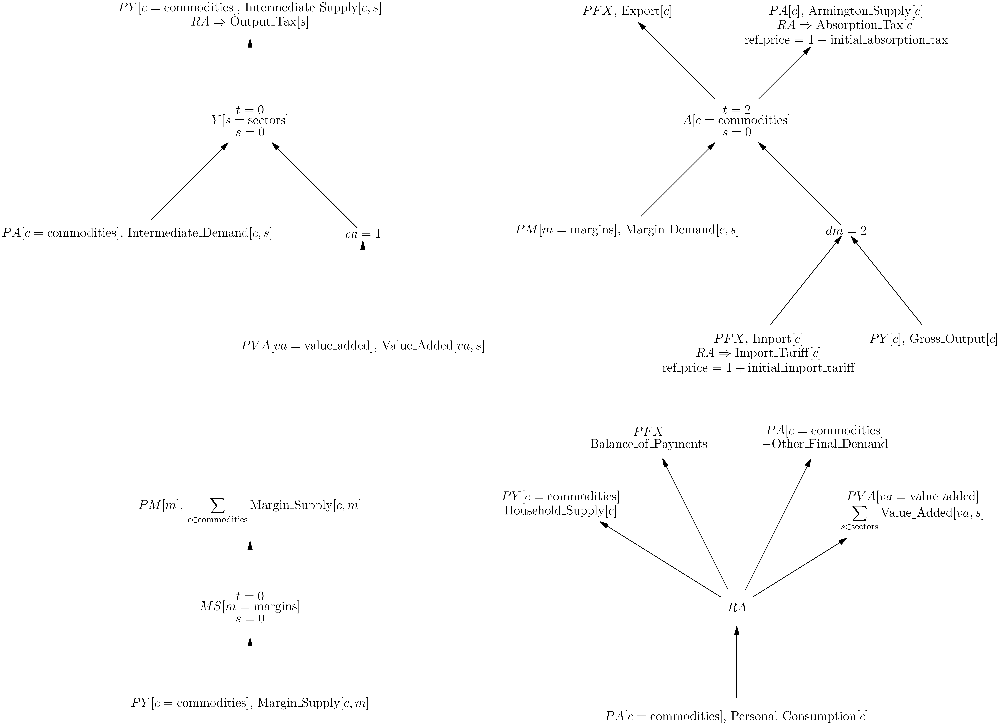

# Overview

The WiNDC National Model is written in [MPSGE](https://github.com/julia-mpsge/MPSGE.jl), a high level language for writing computable general equilibrium models. The syntax allows a modeler to focus on the economic structure of the model rather than the mathematical details of its implementation. For the full model specification, see the documentation: [`national_mpsge`](@ref). 

## Model Diagram

The following tree diagram represents the structure of the WiNDC National Model:



This diagram encapsulates all information for implementing the model, either in MPSGE or as equations in an MCP formulation. Take, for example, the $Y$ sector. In the center of the tree we see,
```math
Y[s = {\rm sectors}]
```
This indicates this production sector is indexed over the set of sectors. Above we see $t=0$ and below $s=0$, these indicate the elasticities of transformation and substitution, respectively. The arrows indicate the flow of goods, arrows pointing toward the center are inputs, and arrows pointing away from the center are outputs. The final non-leaf node is $va=1$, indicating a nest with elasticity of substitution equal to 1. 

Each leaf of the tree contains information to calculate its price and quantity. For example, consider the $PFX$ input to the $A$ sector. The adjusted price of this input is given by,
```math
\frac{PFX\cdot(1+{\rm Import\_Tariff}[c])}{1+{\rm initial\_import\_tariff}}
```
The initial $PFX$ price is a basic price, adding the tax adjusts it to a producer price. Since this quantity is an import, it comes from the Supply table and is calibrated in basic price. The purpose of the reference price in the denominator is to ensure that at the benchmark equilibrium, the adjusted price equals the initial price. This ensures that the benchmark equilibrium is a solution to the model. 

We also need to adjust the reference quantity into producer price. We do this by multiplying by the reference price,
```math
{\rm Import}[c] \cdot (1+{\rm initial\_import\_tariff})
```
Notice the total value of this input at the benchmark equilibrium is the producer price of imports:
```math
\begin{align*}
\frac{PFX\cdot(1+{\rm Import\_Tariff}[c])}{1+{\rm initial\_import\_tariff}} \cdot {\rm Import}[c] \cdot (1+{\rm initial\_import\_tariff}) &= PFX \cdot (1+{\rm Import\_Tariff}[c]) \cdot {\rm Import}[c] \\
& = {\rm Total\_Value\_of\_Imports}[c] + {\rm Import\_Tariff\_Revenue}[c]
\end{align*}
```

The same idea holds for the consumer $RA$, except that outputs represent endowments and inputs represent final demands.

## Social Accounting Matrix

This can be converted to a traditional social accounting matrix by taking the sectors and consumers on the rows and the commodities on the columns: 

|           | $Y[s]$                    | $A[c]$              | $MS[m]$                   | $RA$ | 
|:---:      |:---:                      |:---:                |:---:                      |:---:|
| $PY[c]$   | Intermediate_Supply[c,s]  | -Gross_Output[c]    | -Margin_Supply[c,m]       | Household_Supply[c]      |         
| $PA[c]$   | -Intermediate_Demand[c,s] | Armington_Supply[c] |                           | -Other_Final_Demand - Personal_Consumption[c]      |      
| $PM[m]$   |                           | -Margin_Demand[c,s] | $\sum {\rm Margin\_Supply}[c,m]$ |       |      
| $PFX$     |                           | Export[c]-Import[c] |                           | Balance_of_Payments     |    
| $PVA[va]$ | Value_Added[va,s]         |                     |                           | $\sum {\rm Value\_Added}[va,s]$     |        

However, doing so will obscure the nested structure of the production sectors, hide the elasticities, and require additional discussion to allocate taxes. 